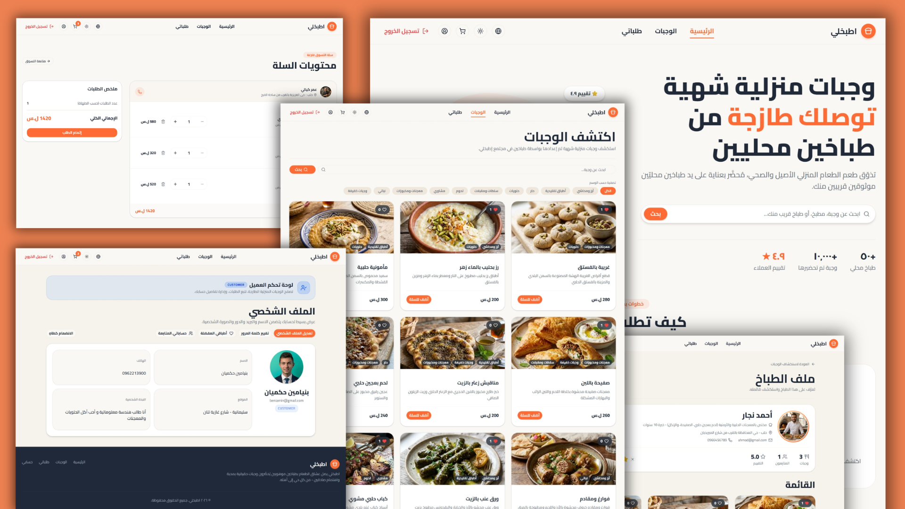

# 🍲 Etbokhly

## 📚 Overview

Etbokhly is a homemade food sharing web application connects food lovers with talented home chefs who prepare authentic meals. Customers can discover trusted local chefs, browse today's menus, place orders, and pay the chef face-to-face when they pick up their meal.

This repository is a monorepo containing two applications:
- `frontend/` - Next.js Pages Router Web App

- `backend/` - Express.js Prisma PostgreSQL

## 🖼️ Screenshot



## ✨ Features

- 🌐 **i18n with two languages** - full Arabic (RTL) and English (LTR) support through locale dictionaries
- 🌙 **Dark mode** - optional theme toggle powered by **next-themes**
- 🛂 **Role-based access** - three distinct protected roles: **Admin**, **Chef**, and **Customer**
- 🔍 **Browse meals** with **search** and **filter** by tag
- 🛒 **Ordering meals** - add to a cart grouped per chef, then checkout with a full status flow
- 📱 **IG-style interactions** - social features **follow**, **like** and **rate** chefs
- 🔐 **Secure authentication** with **JWT** and email password reset

## 👥 User Roles

Etbokhly allows authenticated users to perform actions based on their role:

1. 🛠️ **Admins**

   - Manage chef requests
   - Manage meal creation & edit requests
   - Manage users, meals, and tags

2. 🧑‍🍳 **Chefs**

   - Create and manage their own meals
   - Receive customer orders
   - Accept, reject, or delivered orders

3. 🍽️ **Customers**

   - Browse chefs and their menus
   - Place orders and pay in person
   - Rate, like & follow chefs

## 🧰 Tech Stack

**Frontend**

- ⚡ Next.js (framework)
- ⚛️ React.js (library)
- 🟨 JavaScript (ES6+)
- 🎨 Tailwind CSS (styles)
- 🧩 shadcn/ui (components)
- 📋 react-hook-form (forms)
- 🌗 next-themes (dark mode)
- 🌐 i18n (ar / en dictionaries)

**Backend**

- 🟩 Node.js (runtime)
- 🚀 Express.js (framework)
- 🧩 Prisma (ORM)
- 🗄️ PostgreSQL (Neon)
- 🔐 jws (authentication)
- 🔑 bcryptjs (password hashing)
- 🖼️ Cloudinary (images)
- ✉️ nodemailer (emails)

## 🗂️ Project Structure

```
frontend/
├── components/    # UI & feature components (admin, chef, home, orders, profile…)
├── context/       # AuthContext - global authentication state
├── dictionaries/  # ar.js / en.js localization
├── hooks/         # useAuth, useCart, useOrder, useMeals, useProfile...
├── pages/         # App routes (auth, admin, chef, meals, orders, profile…)
└── styles/        # Global CSS & Tailwind configuration

backend/
├── controllers/       # auth, user, meal, order, chef, admin, tag…
├── routes/            # user, meal, order, chef, admin, tag…
├── lib/               # Prisma client
├── utils/             # catchAsync, appError, pagination, cloudinary, email
├── prisma/            # schema.prisma & migrations
└── server.js          # Express application entry point
```

## 🚀 How to Run

### Backend

```bash
cd backend
npm install
npx prisma generate
npm run dev
```

### Frontend

```bash
cd frontend
npm install
npm run dev
```

## 🔐 Authentication & Security

### 1️⃣ Client-Side

- **Global user context:** `AuthContext` stores the authenticated user and provides `login()` & `logout()` functions.
- **Persistent Login:** restores the user session on page refresh using a stored JWT token.

### 2️⃣ Server-Side

- **`protect` Middleware:** verifies the JWT token and rejects unauthenticated requests with 401.
- **`restrictToAdmin` / `restrictToChef`:** enforces role-based access and rejects with 403.

Passwords are hashed with **bcryptjs**, and password resets are sent via signed email tokens.

## 🚧 Future Improvements

- 💳 **Online Payments:** extend the current cash-on-pickup model with real payment gateways.
- 📦 **Delivery System:** introduce delivery logistics and tracking.
- 🤖 **AI Chatbot:** an AI assistant that suggests meals to users based on their preferences.
- 📱 **Progressive Web App (PWA):** installable app with offline support.
- 🔔 **Real-Time Notifications:** instant order status updates for customers and chefs.

## 👥 Contributors

- Beniamin Hekimian - Frontend Developer
- Jwan Mohamad - Backend Developer
- Mohammad Hassan Sawaha - Backend Developer
- Besher Labban - Backend Developer
- Wael A. Baba - UI/UX Designer